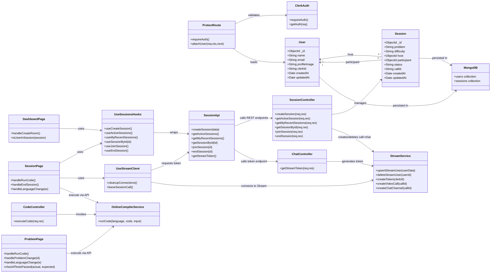
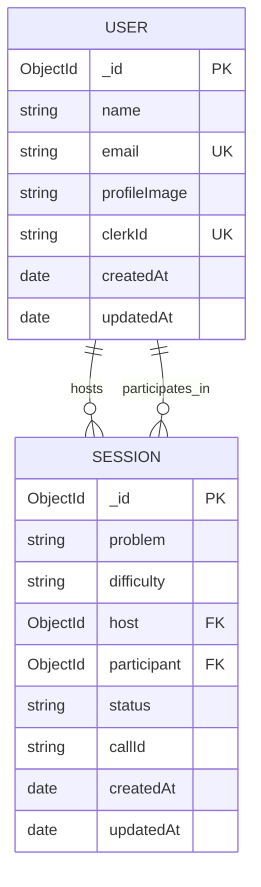
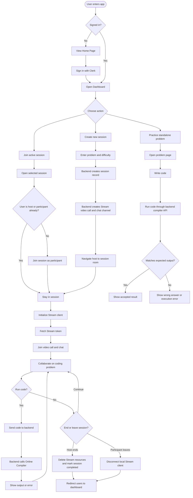
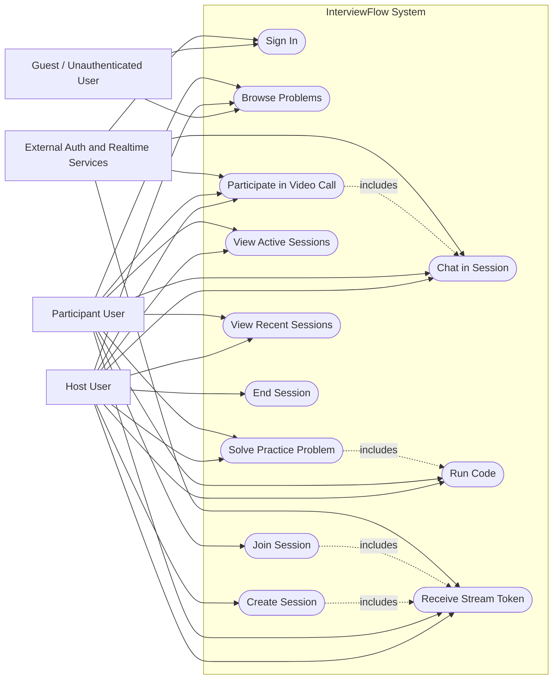
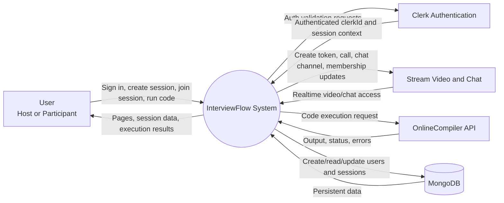
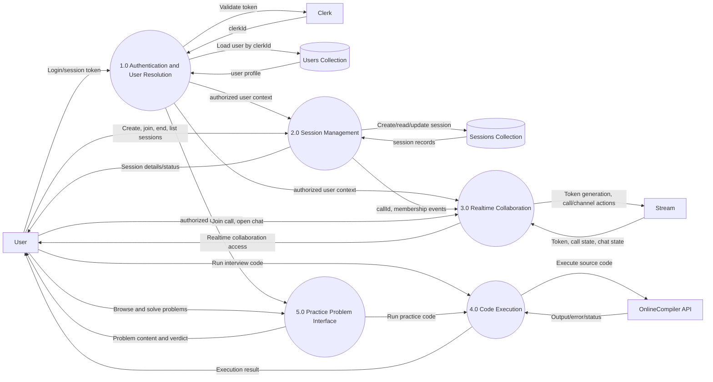

# InterviewFlow System Diagrams

This document contains Mermaid code for the main structural and behavioral diagrams of the `InterviewFlow` project based on the current frontend and backend codebase.

## 1. Class Diagram



## 2. ER Diagram



## 3. Sequence Diagram

The sequence below shows the main collaborative session lifecycle: create session, join session, initialize Stream, and end session.

```mermaid
sequenceDiagram
    autonumber
    actor Host as Host User
    actor Participant as Participant User
    participant UI as Frontend UI
    participant API as Express API
    participant Auth as Clerk
    participant DB as MongoDB
    participant Stream as Stream Video/Chat
    participant Compiler as OnlineCompiler

    Host->>UI: Create session(problem, difficulty)
    UI->>API: POST /api/sessions
    API->>Auth: Validate token via protectRoute
    Auth-->>API: clerkId
    API->>DB: Create Session(host, problem, difficulty, callId)
    DB-->>API: session
    API->>Stream: Create video call(callId)
    API->>Stream: Create chat channel(callId)
    Stream-->>API: resources created
    API-->>UI: session details
    UI-->>Host: Navigate to /session/:id

    Participant->>UI: Open active session
    UI->>API: GET /api/sessions/:id
    API->>Auth: Validate token
    API->>DB: Load session + populate host/participant
    DB-->>API: session
    API-->>UI: session details

    UI->>API: POST /api/sessions/:id/join
    API->>Auth: Validate token
    API->>DB: Check session rules and save participant
    API->>Stream: Add participant to chat channel
    Stream-->>API: member added
    API-->>UI: joined session

    par Host stream init
      UI->>API: GET /api/chat/token
      API->>Auth: Validate token
      API->>Stream: Create user token
      Stream-->>API: stream token
      API-->>UI: token + profile
      UI->>Stream: Join video call(callId)
      UI->>Stream: Connect chat user and watch channel
    and Participant stream init
      UI->>API: GET /api/chat/token
      API->>Auth: Validate token
      API->>Stream: Create user token
      Stream-->>API: stream token
      API-->>UI: token + profile
      UI->>Stream: Join video call(callId)
      UI->>Stream: Connect chat user and watch channel
    end

    Host->>UI: Run code
    UI->>API: POST /api/code/execute
    API->>Compiler: Run code for selected language
    Compiler-->>API: output/error/status
    API-->>UI: execution result

    Host->>UI: End session
    UI->>API: POST /api/sessions/:id/end
    API->>Auth: Validate token
    API->>DB: Verify host and load session
    API->>Stream: Delete video call
    API->>Stream: Delete chat channel
    API->>DB: Update session status=completed
    API-->>UI: session completed
    UI-->>Host: Navigate to dashboard
    UI-->>Participant: Poll detects completed session and redirects
```

## 4. Activity Diagram



## 5. Use Case Diagram

Mermaid does not have native UML use-case notation, so the use-case diagram is represented with a flowchart-style UML approximation.



## 6. Context Level Diagram

This is the context-level DFD (Level 0), showing `InterviewFlow` as one process interacting with external entities.



## 7. First Level Diagram

This is the Level 1 DFD, decomposing `InterviewFlow System` into major internal processes.



## Notes

- `User` and `Session` are the two persisted MongoDB entities in the current codebase.
- Problem metadata is currently stored in frontend static data, so it appears in flows and pages but not in the ERD as a database entity.
- The use-case and DFD-style diagrams are expressed with Mermaid flowcharts because Mermaid does not provide a full native UML use-case renderer.
